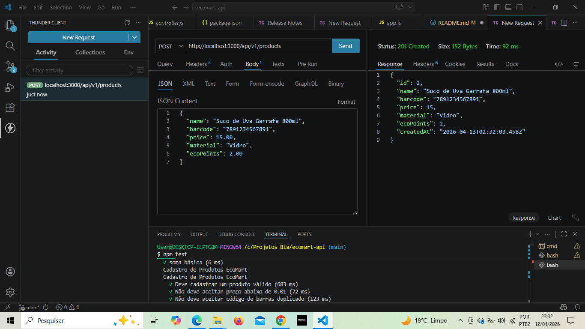
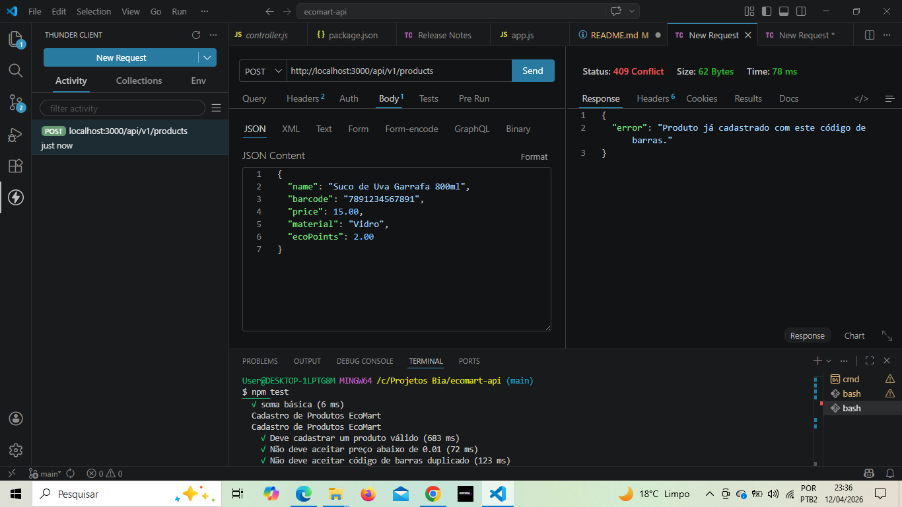
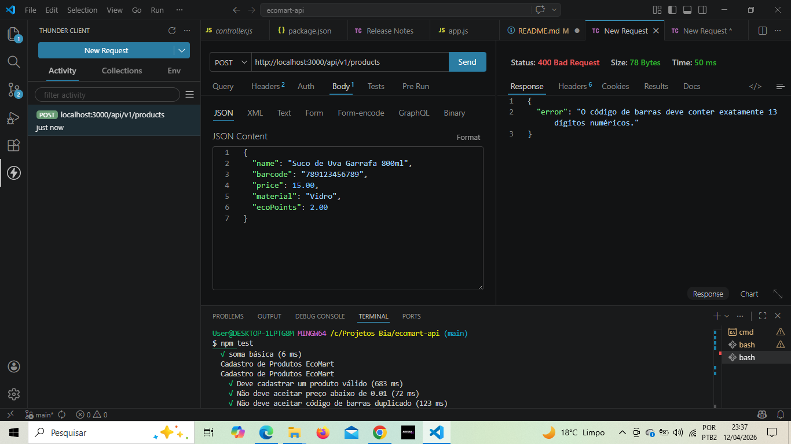

#   EcoMart API - Cadastro de Produtos Sustentáveis

O **EcoMart** é um sistema de inventário para supermercados focado em economia circular. A API permite o cadastro de produtos, validando critérios de reciclagem e calculando "Eco-Pontos" que incentivam o descarte correto de embalagens em troca de descontos.


##  Status do Projeto
Este projeto foi concluído com sucesso, cobrindo desde a configuração do servidor até a implementação de testes automatizados e documentação.


##  Tecnologias e Padrões
* **Ambiente:** Node.js v24+
* **Framework:** Express
* **Padrão de Módulos:** CommonJS (Uso de `require` e `module.exports`)
* **Testes:** Jest & Supertest
* **Banco de Dados:** Armazenamento em memória (volátil)


##  Estrutura do Projeto
```text
ecomart-api/
├── src/
│   ├── app.js          # Configuração e rotas do Express
│   ├── controller.js   # Lógica e regras de negócio
│   └── server.js       # Inicialização do servidor (porta 3000)
├── tests/
│   └── product.test.js # Testes automatizados de validação
├── package.json        # Dependências e scripts
└── README.md           # Documentação do projeto
````


##  Regras de Negócio Implementadas
 Durante o desenvolvimento, aplicamos as seguintes restrições no cadastro:

* Valor Mínimo: O preço do produto deve ser igual ou superior a R$ 0,01.

* Código de Barras (EAN-13): Deve possuir exatamente 13 dígitos numéricos.

* Unicidade: Não é permitido cadastrar dois produtos com o mesmo código de barras.

* Materiais Permitidos: Apenas 'Plástico', 'Vidro', 'Alumínio', 'Papel' ou 'TetraPak'.

* Limite de Recompensa: O valor de ecoPoints não pode exceder 20% do valor total do produto para garantir a viabilidade do negócio.


##  Como Instalar e Rodar:
1. **Clone o repositório:**
````
Bash
````
````
git clone [https://github.com/biafinotti/ecomart-api.git](https://github.com/biafinotti/ecomart-api.git)
````

2. **Instale as dependências:**
````
Bash
````
```
npm install
````

3. **Inicie o servidor:**
````
Bash
````
```
npm start
````

*O console exibirá:* ♻️ *EcoMart API rodando em http://localhost:3001* 


##  Testando a API

**Via Thunder Client / Postman:**

* **Método:** POST

* **URL:** http://localhost:3001/api/v1/products

* **Body (JSON):**
```
JSON
````
```
{
  "name": "Suco de Uva Garrafa 800ml",
  "barcode": "7891234567890",
  "price": 15.00,
  "material": "Vidro",
  "ecoPoints": 2.00
}
````
````
Resultado esperado ✔: Status 201 Created e o objeto do produto com ID gerado.
````



````
Resultado esperado ✘: Status 400 Bad Conflict/Request com a mensagem de erro correspondente.
````





**Via Testes Automatizados:**
```
Bash
```
````
npm test
````


## Documentação Interativa (Swagger)

A API conta com uma interface visual para testes. Com o servidor rodando, acesse:

 `http://localhost:3001/api-docs`


Nesta página, você pode usar o botão **"Try it out"** para enviar requisições diretamente do navegador, sem precisar de ferramentas externas.

````
Bash
````
````
npm install swagger-ui-express
````


## Versionamento no Github

Para finalizar o desafio, a API deverá ser versionada em um repositório no GitHub:

**Inicie o repositório:** git init

**Crie o .gitignore:** Adicione node_modules para não subir arquivos desnecessários.

**Commit:** git add . e git commit -m "feat: setup API de reciclagem com testes"

**Push:** Crie um repositório no Github e linke-o com git remote add origin <sua-url>.


##  Checklist do Desafio
* [x] API com Node.js e Express.

* [x] Validações de regras de negócio complexas.

* [x] Documentação interativa com **Swagger**.

* [x] Persistência em memória (Array).

* [x] Testes de integração (Jest/Supertest).

* [x] Código versionado no GitHub.


## Destaques do Desafio:

* **IA Generativa:** Utilizada para auxiliar na escrita de rotas e na criação de casos de teste.

* **Documentação:** Swagger implementado para facilitar a execução de testes de contrato e integração.

* **Padronização:** Estrutura organizada para garantir que cada teste seja repetível e confiável.


##

**Desenvolvido com o auxílio de IA Generativa para fins de aprendizado em desenvolvimento de APIs.**